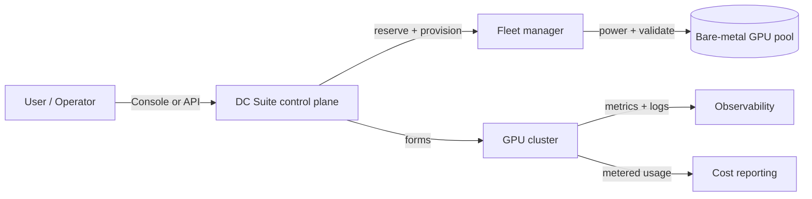

# DC Suite

**DC Suite is a control plane for self-service GPU cloud clusters on
bare-metal infrastructure.** It turns a pool of physical GPU servers into an
on-demand cloud: users create right-sized clusters in a few clicks, run
workloads on them, and tear them down — while operators keep a single fleet
healthy, secure, and accounted for.

-   :material-account-group: **For users**

    Create GPU clusters, run SLURM jobs, apply software templates, build
    images, watch live metrics and logs, and track your spend.

    [:octicons-arrow-right-24: User Guide](user-guide/index.md)

-   :material-server-network: **For operators**

    Deploy DC Suite, onboard bare-metal machines, wire up SSO, and run the
    fleet with confidence.

    [:octicons-arrow-right-24: Operators Guide](operators/index.md)

## What DC Suite does

- **Self-service clusters.** Pick a hardware profile and a node count; DC
  Suite reserves machines from the pool, provisions them from a golden image,
  forms a working cluster, and hands it back ready to use.
- **Heterogeneous fleets.** A single cluster can span multiple hardware
  profiles (node groups), and the fleet can hold many GPU and CPU SKUs at
  once.
- **Software templates.** Apply curated or custom stacks (schedulers,
  frameworks, dashboards) to a running cluster. Admins publish global
  templates; users keep private ones.
- **Golden images.** Build, burn-in, and promote machine images through a
  `BUILT → CANARY → STABLE` lifecycle so every cluster boots from a known-good
  base.
- **Observability built in.** Live GPU/scheduler metrics and streamed
  control-plane logs, per cluster.
- **Cost visibility.** Metered node-hours and GPU-hours rolled up per
  organization, in your billing currency.
- **Secure by default.** SSO-only sign-in, scoped roles, per-tenant
  isolation, and short-lived cluster access credentials.

## How it fits together

The **control plane** exposes a web console and a REST API. When you request a
cluster it asks the **fleet manager** to reserve and validate machines from
the **bare-metal pool**, provisions them from a golden image, and forms a
**GPU cluster**. Usage flows into **observability** and **cost reporting** for
the life of the cluster.

## New here?

1. **Users:** start with [Getting Started](user-guide/getting-started.md),
   then [Core Concepts](user-guide/concepts.md).
2. **Operators:** start with [Architecture](operators/architecture.md), then
   [Installation](operators/installation.md).
3. Everyone: keep the [Glossary](reference/glossary.md) and
   [FAQ](reference/faq.md) handy.
