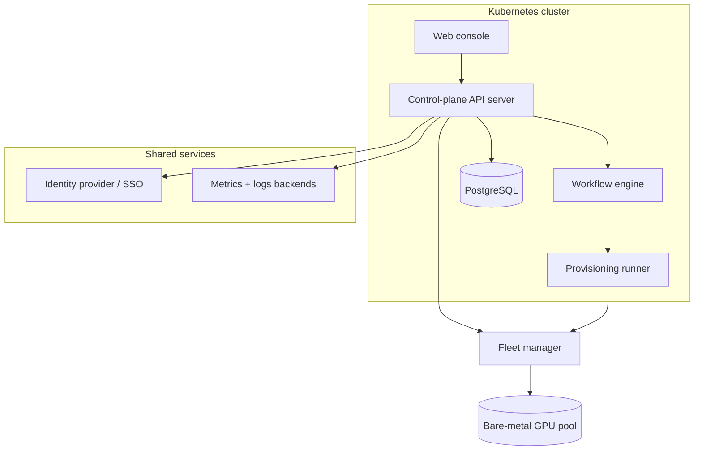
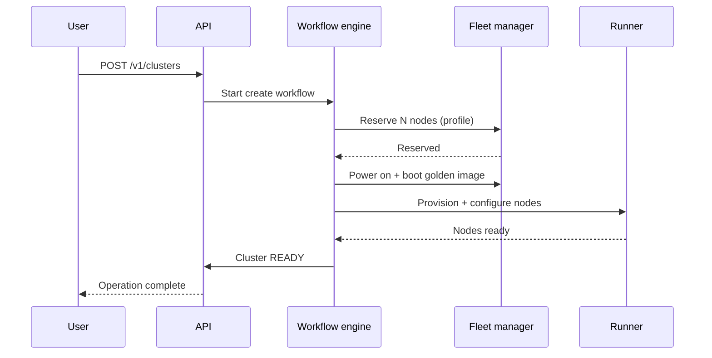

# Architecture

DC Suite is a set of services that run on Kubernetes and drive a bare-metal
GPU fleet through a fleet manager.

## Components

| Component | Role |
| --- | --- |
| **Web console** | The React single-page app users and operators interact with. |
| **API server** | The control plane: REST API, authz, cluster lifecycle, catalog. |
| **Workflow engine** | Runs durable, multi-step operations (create, resize, delete) reliably. |
| **Provisioning runner** | Executes per-run infrastructure jobs that provision nodes. |
| **PostgreSQL** | System of record for clusters, nodes, images, templates, tenancy, cost. |
| **Fleet manager** | Owns the physical machines: discovery, power, validation, allocation. |
| **Identity provider** | SSO for all sign-in (no local passwords). |
| **Metrics + logs backends** | Time-series metrics and log aggregation for observability. |

## Request flow: creating a cluster

The API returns an operation id immediately; the workflow engine drives the
rest to completion (or a clean failure) even across restarts.

## Fleet integration

The fleet manager is the authority on physical machines. DC Suite:

1. **Reserves** machines of a profile from the pool.
2. Asks the fleet manager to **power on and validate** them.
3. **Provisions** them from a golden image and forms the cluster.
4. On delete, **releases** them — the fleet manager sanitizes and re-validates
   each machine before returning it to `AVAILABLE`.

A periodic **fleet sync** reconciles DC Suite's node table with the fleet
manager's inventory: machines the fleet reports available become selectable;
machines it reports assigned/sanitizing/unhealthy are quarantined so they're
never handed out by mistake.

## Data model (high level)

- **Organizations → tenants → clusters → nodes.**
- **Images** and **templates (stacks)** are catalog objects.
- **Usage** records feed **cost** rollups.
- **Bare-metal machines** are the operator's registration of physical hardware,
  linked to fleet-manager machine IDs.

## Security posture

- **SSO-only** sign-in; a separate operator door gates admin access.
- **Scoped RBAC**: roles grant permissions at installation / org / tenant
  scope.
- **Per-tenant isolation** across clusters, logs, and cost.
- **Short-lived cluster access**: SSH keys are delivered to nodes and their
  application is confirmed; credentials aren't long-lived secrets baked into
  images.

---

**Next:** [Installation](installation.md).
