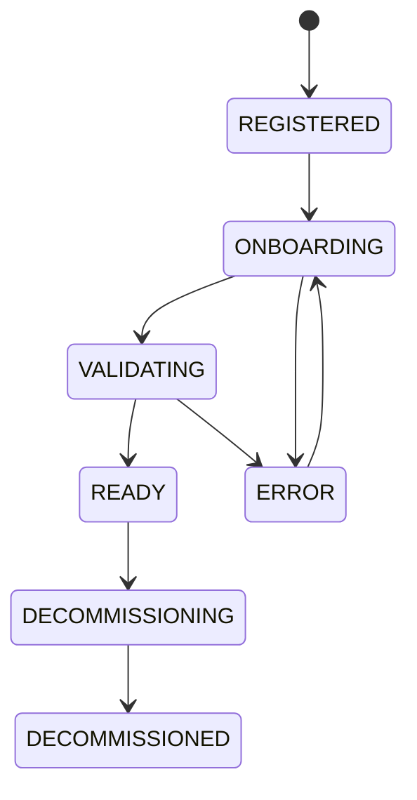

# Bare-Metal Onboarding

Capacity comes from physical machines you register and hand to the fleet
manager. This page covers the machine lifecycle and the day-2 states you'll
see.

## Registering a machine

An operator registers a machine with its hardware spec and **BMC**
(out-of-band management) coordinates and credentials. The BMC password is
write-only — DC Suite stores it encrypted and never returns it in API
responses; responses only report whether a password is set.

Registration flow:

| State | Meaning |
| --- | --- |
| **REGISTERED** | Known to DC Suite, not yet handed to the fleet manager. |
| **ONBOARDING** | Registration with the fleet manager is in flight. |
| **VALIDATING** | The fleet manager is discovering/validating the machine. |
| **READY** | Validated and usable; available to the pool. |
| **ERROR** | Onboarding or a later report failed; `last_error` explains why. |
| **IN_USE** | *Display only* — an in-cluster machine the fleet reports in error; shown as in-use rather than a scary error. |
| **DECOMMISSIONING / DECOMMISSIONED** | Being removed / removed (record kept). |

Before onboarding, DC Suite validates the BMC is reachable with the given
credentials; onboarding is gated on a fresh passing BMC check.

## Power-state contract

Idle pool machines are **parked powered off** to save energy. A responsive
BMC on a cold host is the "machine is healthy and available" signal — DC Suite
tolerates the powered-off state for parked machines and powers a machine on
only when it's being allocated to a cluster.

## Fleet sync and pool health

A periodic sync reconciles DC Suite's node table with the fleet manager:

- A machine the fleet reports **available** projects as `AVAILABLE` (bookable).
- A machine the fleet reports **assigned/sanitizing/unhealthy** is
  **QUARANTINE** so it's never handed out by mistake.
- A quarantined, unowned machine the fleet certifies healthy again is
  **recovered** back to `AVAILABLE` automatically — once its bare-metal
  registration is itself `READY`.

## Day-2 states you'll see

- **`ERROR` on a machine that's actually in a running cluster** — often a
  stale background validation the fleet couldn't run while the box was busy.
  DC Suite displays such machines as **IN_USE** rather than a red error; the
  stored state stays `ERROR` so auto-recovery still applies once the fleet
  clears it.
- **A quarantined machine that won't recover** — its bare-metal row is stuck
  in `ERROR`/`VALIDATING`, or the fleet manager is stuck mid-terminate. See
  the [node recovery runbook](runbooks.md#a-node-is-stuck-quarantine).

## Decommissioning

Decommissioning removes a machine from service. The record is retained for
history. Only machines not currently serving a cluster should be
decommissioned.

---

**Next:** [SSO & Identity](sso.md).
