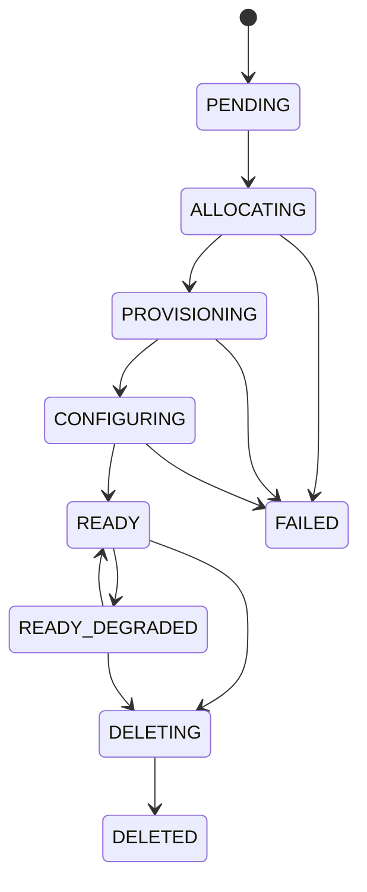

# Core Concepts

A short tour of the nouns you'll meet throughout DC Suite.

## Cluster

A **cluster** is a set of machines DC Suite reserves, provisions, and wires
together for you. It has a lifecycle:

- **READY** — fully formed and usable.
- **READY_DEGRADED** — usable but one or more nodes need attention.
- **FAILED** — provisioning could not complete (the detail page explains why).
- **DELETED** — torn down; the record is kept for history and cost.

## Node

A **node** is one machine in a cluster. Nodes come from the fleet's pool and
carry a hardware **profile**. Within the fleet a node has its own lifecycle —
`AVAILABLE`, `RESERVED`, `IN_CLUSTER`, `SANITIZING`, `QUARANTINE` — but as a
user you mostly care that a cluster's nodes are up and reachable.

## Hardware profile

A **profile** describes a class of machine — GPU model, GPUs per node,
allocation unit, interconnect. Examples: `gpu-l40s`, `gpu-hgx-h100`. When you
create a cluster you choose a profile and a node count; the profile picker
shows **how many nodes are available right now** so you only ask for what the
fleet can satisfy.

A single cluster can mix profiles as separate **node groups** — for example a
few H100 nodes for training plus CPU nodes for pre-processing. This is a
*heterogeneous* cluster.

## Image

An **image** is the golden machine image nodes boot from. Images are
versioned and move through a lifecycle:

`BUILT → CANARY → STABLE → DEPRECATED`

Clusters default to the current **STABLE** image; you can pin a specific
version at creation time. See [Images](images.md).

## Template (stack)

A **template** (also called a *stack*) is a packaged piece of software you
apply to a running cluster — a scheduler, an ML framework, a dashboard.
Templates can be **global** (published by an admin, visible to everyone) or
**private** (yours only). See [Templates](templates.md).

## Tenant and organization

- An **organization** is the top-level account boundary. Cost is rolled up
  per organization, and access is scoped by it.
- A **tenant** is a project/team within an organization, with its own quotas
  (max nodes, max clusters) and its own clusters.

Your identity belongs to an organization and typically a tenant; you only see
and act on resources within your scope.

## Roles and permissions

DC Suite uses **scoped roles**. A role grants a set of permissions
(`cluster:write`, `billing:write`, `baremetal:read`, …) at a scope
(installation, organization, or tenant). If an action is refused or a control
is hidden, you lack the permission at that scope — ask an administrator.

## Operations

Long-running actions (create, resize, delete) run as asynchronous
**operations** with their own status. The console tracks them for you; via
the API you poll the operation until it completes. See
[API Reference](api.md).

---

**Next:** put it to work in [Creating a Cluster](creating-clusters.md).
