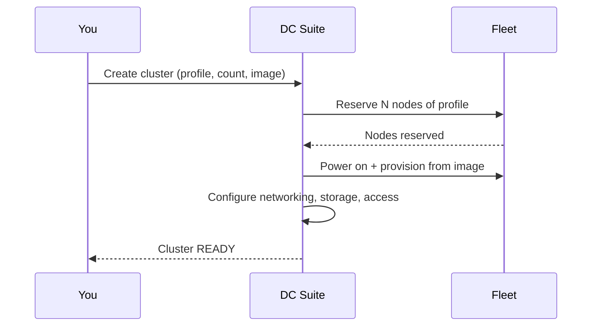

# Creating a Cluster

You can create a cluster from the **console** (Clusters → Create) or the
**API** (`POST /v1/clusters`). Both take the same inputs.

## Inputs

| Field | Meaning |
| --- | --- |
| **Name** | A human label for the cluster. |
| **Profile** | The hardware profile for the nodes (e.g. `gpu-l40s`). |
| **Node count** | How many nodes to reserve, bounded by availability. |
| **Image version** | Golden image to boot from. Defaults to the current `STABLE`. |
| **Failure policy** | What to do if a node fails to provision (fail fast vs. best-effort). |
| **Shared storage quota** | Shared scratch capacity for the cluster, in GiB. |
| **Init script** *(optional)* | A script run on nodes after provisioning. |

### Availability

The profile picker shows **"N nodes available now."** That number is the
count of pool nodes in the `AVAILABLE` state for that profile. If it reads
**0**, the fleet currently has no free machines of that type — either they're
all in use, or an operator needs to return machines to the pool. You can't
reserve more than are available.

## Heterogeneous clusters (node groups)

A cluster can contain more than one profile by defining multiple **node
groups**. Each group has its own profile and node count. Use this when a
workload needs mixed hardware — for example GPU training nodes plus CPU
pre-processing nodes in one cluster.

In the console, add a group per profile in the create form. Each group's
count is validated against that profile's own availability.

## What happens after you submit



The create call returns immediately with an **operation id**. The console
follows it for you; via the API you poll
`GET /v1/clusters/{id}/operations/{opID}` until it completes.

## API example

```bash
curl -sS -X POST https://your-dc-suite.example.com/v1/clusters \
  -H "Authorization: Bearer $DCS_TOKEN" \
  -H "Content-Type: application/json" \
  -d '{
        "name": "training-1",
        "profile": "gpu-l40s",
        "node_count": 2,
        "image_version": "",
        "failure_policy": "fail_fast",
        "shared_storage_quota_gib": 512
      }'
```

An empty `image_version` selects the current `STABLE` image. The response
contains the new cluster and an `operation_id`.

## If creation fails

- **`FAILED` with "insufficient capacity"** — fewer nodes were available than
  requested. Lower the count or wait for machines to return to the pool.
- **`FAILED` during provisioning** — a node couldn't boot the image or form
  the cluster. The detail page shows the reason; retry, or try a different
  image version.

---

**Next:** [Managing Clusters](managing-clusters.md).
