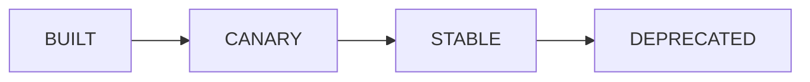

# Images

An **image** is the golden machine image a cluster's nodes boot from. Images
are versioned and promoted through a lifecycle so every cluster starts from a
known-good base.

## Image lifecycle

| State | Meaning |
| --- | --- |
| **BUILT** | Freshly built; not yet vetted for general use. |
| **CANARY** | Under evaluation — usable, but not the default. |
| **STABLE** | The recommended default; new clusters use it unless you pin another. |
| **DEPRECATED** | Kept for history/reproducibility, not offered for new clusters. |

## Choosing an image for a cluster

At create time, leave the image version empty to use the current **STABLE**
image, or pin a specific version for reproducibility. Pinning is useful when
you need to reproduce a previous environment exactly.

## Building an image

DC Suite supports **self-service image builds**. A build runs as a sequence of
steps and produces a versioned image plus a **burn-in** report that checks the
image is actually good (GPU present, scheduler works, interconnect health).

Typical flow:

1. Start a build from a recipe (base + customizations).
2. Watch the build steps run (`PENDING → RUNNING → SUCCEEDED`/`FAILED`, some
   `SKIPPED`).
3. Review the **burn-in** result once the image reaches `BUILT`.
4. Promote it to `CANARY`, then `STABLE`, when you're confident.

## Promotion and deprecation

| Action | Endpoint |
| --- | --- |
| List images | `GET /v1/images` |
| Inspect burn-in | `GET /v1/images/{name}/{version}/burnin` |
| Promote (advance lifecycle) | `POST /v1/images/{name}/{version}/promote` |
| Deprecate | `POST /v1/images/{name}/{version}/deprecate` |

Promotion is deliberate: an image only becomes the `STABLE` default when
someone promotes it there, so the fleet's default never changes by accident.

!!! note "Reproducibility"
    Because images are immutable and versioned, pinning an image version in a
    cluster spec reproduces the same base environment every time — valuable
    for long-running experiments and audits.

---

**Next:** [Observability](observability.md).
