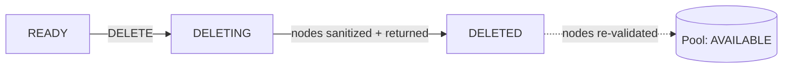

# Managing Clusters

Everything below is available from a cluster's detail page in the console, and
via the REST API.

## Inspect

- **`GET /v1/clusters`** — list your clusters.
- **`GET /v1/clusters/{id}`** — one cluster, with its spec and state.
- **`GET /v1/clusters/{id}/nodes`** — the cluster's nodes and their states.

The detail page shows the cluster's state, its node groups, access
information, exposed ports, and recent operations.

## Power control

You can power-cycle a cluster or an individual node without deleting it:

- **`POST /v1/clusters/{id}/power`** — fan a `reboot` / `stop` / `start` action
  across all nodes.
- **`POST /v1/clusters/{id}/nodes/{nodeId}/power`** — one node.
- **`GET /v1/clusters/{id}/power`** — per-node live power state (and, where the
  hardware reports it, draw and temperature).

Stopping a cluster parks its nodes powered off; starting brings them back.
This is useful to pause an idle cluster without losing it.

## Resize

Change a cluster's size by adjusting its node groups. Growing a group reserves
more machines of that profile (bounded by availability); shrinking returns
machines to the pool. Resize runs as an operation, like create.

!!! note
    Some interconnect-bound profiles resize in whole-domain units (for example
    a full NVLink domain at a time) rather than single nodes. The console only
    offers valid resize targets for the profile.

## SSH keys

Manage the SSH keys authorized on a cluster after creation:

- **`PUT /v1/clusters/{id}/ssh-keys`** — replace the authorized key set.

Replacing the set is atomic: the keys you send become the complete authorized
list. Providing keys takes precedence over any password-based access. See
[Access & Networking](access-networking.md).

## Delete

- **`DELETE /v1/clusters/{id}`** — tear the cluster down.

Deletion releases the nodes back to the pool (they're sanitized and
re-validated before they become available again) and stops metering. The
cluster record is retained in `DELETED` state for history and cost reporting.

!!! warning "Deletion is final for the cluster's data"
    Anything on cluster-local storage is lost when the cluster is deleted.
    Copy out results, or use durable shared storage, before deleting.

---

**Next:** [Access & Networking](access-networking.md).
