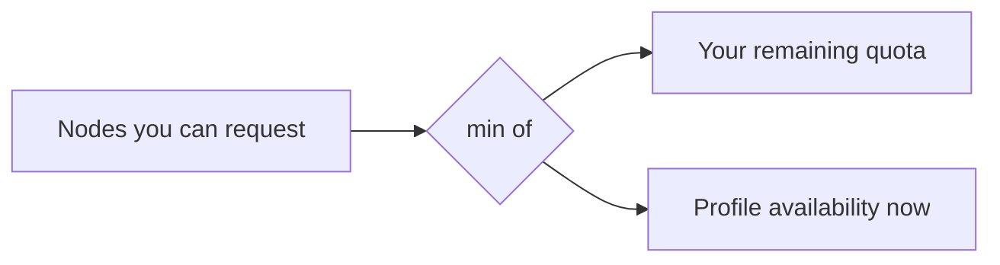

# Quotas & Limits

DC Suite bounds consumption per tenant so one team can't exhaust the fleet.
This page explains the limits you'll run into and how to work with them.

## Tenant quotas

Each tenant has quotas set by an administrator:

| Quota | Meaning |
| --- | --- |
| **Max nodes** | The most nodes this tenant can hold across all its clusters at once. |
| **Max clusters** | The most concurrent clusters this tenant can have. |

Your own quota is reported to the console; via the API it's surfaced on your
identity (`GET /v1/whoami`) where the backend exposes it.

If a create or resize would exceed a quota, it's refused up front with a clear
message — you're never left with a half-formed cluster because of a quota.

## Fleet availability

Separate from your quota is **physical availability**: how many nodes of a
profile are free in the pool right now. The create form shows this per
profile. You can only reserve what's both **within your quota** *and*
**available in the fleet** — whichever is smaller.

## Interconnect-bound allocation units

Some profiles allocate in **whole interconnect domains** (for example a full
NVLink domain) rather than single nodes, because splitting a domain would
strand high-bandwidth links. For those profiles the console only offers valid
counts, and resizes move a domain at a time.

## Storage quota

Each cluster has a **shared storage quota** (GiB) you set at creation — the
size of its shared filesystem. See [Storage & Data](storage.md).

## Job-level limits

Within a cluster, the scheduler enforces its own limits — partition
time-limits, per-job GPU/node caps, and queue policies. A job requesting more
resources than the cluster has (or than a partition allows) sits pending. Use
`sinfo` and `scontrol show partition` to see the policy on your cluster.

## Rate & request limits

The API applies sensible request limits to protect the control plane. Handle
`429 Too Many Requests` by backing off and retrying; automation should poll
operations at a modest interval (e.g. every 10s) rather than in a tight loop.

## Raising a limit

Quotas are an administrator setting. If you consistently hit `max_nodes` or
`max_clusters`, ask an admin to raise the tenant's quota — and see
[Cost & Billing](cost.md) so the spend implications are understood first.

---

**Next:** [Running Jobs](jobs.md).
