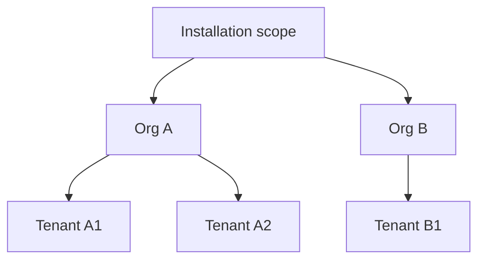

# Security & Isolation

How DC Suite keeps tenants apart and keeps access under control. This page is
useful for users who need to reason about what's protected, and for security
reviewers.

## Identity

- **SSO only.** Every sign-in goes through your organization's OIDC identity
  provider. DC Suite stores no passwords.
- **Two doors.** A general user login and a separately gated operator/admin
  login, so privileged access can be held to a stricter policy.
- **Per-organization IdP.** In a multi-tenant installation each organization
  can bring its own identity provider; a token is matched to its org by the
  `(issuer, client_id)` pair.

## Authorization (scoped RBAC)

Access is governed by **roles** that grant **permissions** at a **scope**:

- **Permissions** are verbs on resource classes — e.g. `cluster:read`,
  `cluster:write`, `billing:write`, `baremetal:read`.
- **Scopes** are nested: **installation** ⊃ **organization** ⊃ **tenant**.
- A grant is a `(role, scope)` pair. Your effective permissions are the union
  of your grants, and they only apply within the scope they were granted at.

`GET /v1/whoami` returns your `effective_grants` and whether you hold any
installation-scope grant.

A tenant user with `cluster:write` at Tenant A1 can create clusters in A1 —
and nowhere else.

## Tenant isolation

- **Clusters** are owned by a tenant; you only see and act on clusters within
  your scope.
- **Logs and metrics** are scoped — the observability API only returns data
  for clusters you can access.
- **Cost** is rolled up per organization; you don't see other orgs' spend.

## Cluster access credentials

- **SSH keys are delivered and confirmed.** When you register keys on a
  cluster, the platform reports whether they actually **landed on the nodes**
  (`keys applied`) versus merely accepted — so a node silently failing to
  apply keys can't masquerade as success.
- **Keys beat passwords.** Registering a key clears any default password.
- **Least privilege.** Give a cluster only the keys that need it; the key set
  you send via `PUT /v1/clusters/{id}/ssh-keys` replaces the whole authorized
  list.

## Network exposure

- Exposed ports get a **per-cluster HTTPS URL** terminated with TLS — no raw
  node IPs.
- **Source restriction** limits a URL to specific CIDR ranges.
- **Disable** turns a public URL off without removing the port definition.
- Freed ports are returned to the pool when a cluster is deleted.

## Secrets and credentials at rest

- BMC and backend credentials are stored encrypted; API responses never return
  credential material (for BMCs, only a `bmc_password_set` boolean).
- Audit-sensitive fields are excluded from responses, logs, and audit events
  by design.

## Auditability

Privileged actions are recorded as audit events with actor, action, resource,
and request context — so who did what, and when, is answerable after the fact.

## What you're responsible for

- Protect your SSH private keys and your IdP credentials.
- Don't expose a port publicly (unrestricted) that serves unauthenticated
  sensitive data — add a source restriction or keep it disabled.
- Copy data you must keep to durable storage; cluster storage is ephemeral
  (see [Storage & Data](storage.md)).

---

**Next:** [Quotas & Limits](quotas.md).
