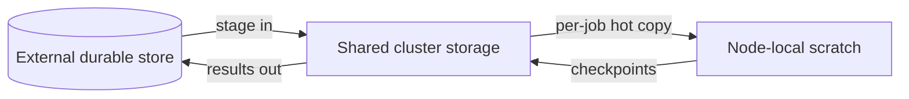

# Storage & Data

GPU workloads are data-heavy. This page explains where data lives on a DC
Suite cluster, how long it survives, and how to get results out before you
tear a cluster down.

## Storage tiers

A cluster typically presents three tiers, each with different speed and
durability characteristics:

| Tier | Backed by | Scope | Survives cluster delete? | Use for |
| --- | --- | --- | --- | --- |
| **Node-local scratch** | The node's own NVMe/SSD | One node | ❌ No | Hot working set for a single node, checkpoints in flight |
| **Shared cluster storage** | A cluster-wide shared filesystem | All nodes in the cluster | ❌ No | Datasets and outputs shared across nodes/jobs |
| **External / durable storage** | Object store or NFS you mount | Outside the cluster | ✅ Yes | Source datasets, final artifacts, anything you must keep |

!!! danger "Cluster-scoped storage is ephemeral"
    Both node-local scratch **and** shared cluster storage are destroyed when
    the cluster is deleted. Treat them as scratch. Anything you need to keep
    must land in external/durable storage before delete.

## Shared cluster storage

When you create a cluster you set a **shared storage quota** (GiB). That
capacity is presented as a shared filesystem mounted on every node, so a
multi-node job can read inputs and write outputs to one place.

- Sizing: set it to your dataset size plus headroom for outputs and
  checkpoints.
- Path: the mount point is shown on the cluster's detail page.
- Performance: shared storage is convenient but slower than node-local NVMe;
  for the hottest data, stage onto node-local scratch at job start.

## A durable-data workflow

1. **Stage in** your dataset from durable storage to shared cluster storage
   once, at the start.
2. For throughput-bound jobs, **copy the hot subset** to node-local NVMe.
3. Write **checkpoints** to shared storage so a single node failure doesn't
   lose progress.
4. **Copy results out** to durable storage before deleting the cluster.

## Getting data in and out

- **Small files:** `scp`/`rsync` over SSH to the login node.
- **Large datasets:** pull directly from your object store on the cluster
  (e.g. with the provider's CLI) into shared storage — much faster than
  pushing from a laptop.
- **Results:** push finished artifacts back to durable storage from a job's
  final step, so nothing depends on you remembering to copy before delete.

## Checklist before deleting a cluster

- [ ] Final artifacts copied to durable storage
- [ ] Latest checkpoint safe outside the cluster
- [ ] Nothing important left only on node-local scratch

---

**Next:** [Security & Isolation](security.md).
